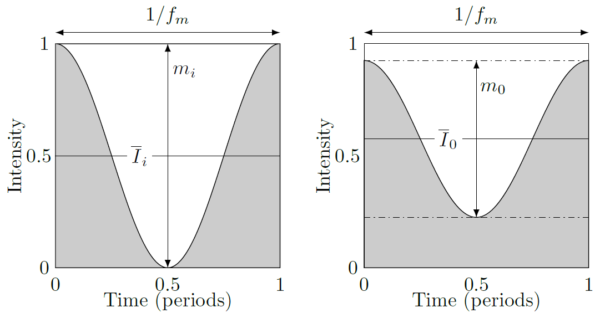
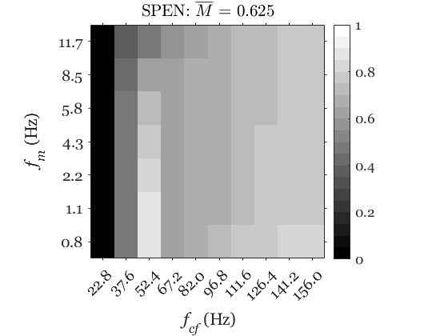

# The Bass Transmission Index (BTI) Toolbox

A MATLAB toolbox to calculate the Bass Transmission Index for loudspeakers.

(c) Lara Harris and Bjørn Kolbrek

## Support

We do not have the capacity to offer much support for the code or its use, as we are both busy with other projects and work. We will however address actual bugs and errors that are reported. Please read the usage guide, code examples and publications to familiarise yourself with the method and the code. The thesis gives the background and reasons for the choices made in developing the model, and should hopefully answer your questions in that regard. The examples included with the toolbox should be enough to allow you to use the method for your own work. 

If you want to do further research on the BTI (see some suggestions under *Future Work* below), we would be happy if you made contact with us, although it's unlikely we can offer much in terms of practical involvement. 

## What is the Bass Transmission Index?

The BTI is an objective measure of a loudspeaker's ability to accurately reproduce low-frequency musical content. The metric aims to describe how well a loudspeaker reproduces the temporal envelope of a dynamic and harmonically-complex signal, something that cannot easily be evaluated from the usual frequency response (magnitude plots). For the mix engineer, perhaps the biggest problem is how a loudspeaker with poor temporal response alters the perceived balance between rhythm section instruments like kick drum and bass guitar. Though not exclusively the case, loudspeakers with ported cabinets (bass reflex loading) are more likely to exhibit this type of problematic behaviour, due to the use of resonant elements to increase bass extension. An incorrect mix made on loudspeakers like this may not transfer well to other sound reproduction systems, and can't be corrected later during mastering, since the two instruments occupy the same part of the audio spectrum. 

Like the STI (Speech Transmission Index), as used in speech intelligibility measurements, the BTI is based on a metric called the Modulation Transfer Function (MTF). MTF-based methods such as these pass an amplitude-modulated signal through the system, varying the rate of the temporal fluctuations across a range of values that are likely to feature in the real-world signals that the system will encounter. The preservation of modulation depth between input and output is used as an indicator of how well the system can reproduce these temporal variations. The figure below illustrates the concept, showing modulation depth for input (mi) and output (mo) signal envelopes.

The BTI evaluates the MTF in 10 frequency bands from 16-160Hz, with 7 modulation frequencies from 0.8-11.7Hz. The algorithm computes a matrix of modulation index scores between 0 and 1 for each combination of frequency band and modulation frequency. This grid of numbers can be used to calculate an overall average score, and is visualised as a grayscale intensity image where white = 1.00 (perfect reproduction). As a rule of thumb for interpreting these BTI intensity images:
* Inconsistent shading in the horizontal direction (left-right) indicates variation in the frequency response magnitude (this is variation across frequency bands).
* Inconsistent shading in the vertical direction (up-down) indicates variation in the faithfulness of envelope transmission (this is variation across modulation frequencies).

Whilst the unweighted mean score alone may be a slightly crude metric to summarise overall performance of a loudspeaker, it is seen from the points above that it incorporates both low-frequency extension *and* temporal accuracy. Thus, flatness of the frequency response magnitude, extension, and rate of low-frequency roll-off (indicative of phase shift through the bass region) are all factors that influence the output scores and visual appearance of results. The figure below shows an example BTI intensity image and mean score for a bass-reflex studio monitor. Frequency bands (centre frequencies) are on the x-axis, and modulation frequencies on the y-axis. 

## The Toolbox

This toolbox implements the algorithm developed by Harris (see *Further Reading* section below). It has been significantly cleaned up and restructured into a MATLAB class by Bjørn Kolbrek. It should be viewed as a reference implementation, and may not be optimal in terms of efficiency or signal processing. 

## License

The BTI Toolbox is free software: you can redistribute it and/or modify
it under the terms of the GNU Lesser General Public License as published by 
the Free Software Foundation, version 2.1.

The BTI Toolbox is distributed in the hope that it will be useful,
but WITHOUT ANY WARRANTY; without even the implied warranty of MERCHANTABILITY or FITNESS
FOR A PARTICULAR PURPOSE. See the GNU Lesser General Public License for more details.

## Usage

The basic usage is very simple: create an instance of the ModulationTransferFunctionCalculator class, give it an impulse response, and call the calculateMTF() method. This process is demonstrated in the sample file BTIdemo.m (note - it may take around 1 minute to compute fully and produce the final image). 

More advanced usage (changing parameters or calculation method) is demonstrated in BTIdemo2.m. 

Also included is the file RunBTI.m, which shows a dialog box allowing you to select any .wav file you want to calculate the BTI of. 

Note that the BTI was developed for use with anechoic IRs. We do not yet have experience with how well the calculation methods in this toolbox work in the presence of reflections etc, but it should not be expected that the results will be accurate. The IR should be long enough to resolve the frequency response down to at least 16Hz with 1-2Hz resolution. Some sort of nearfield, ground plane or outdoor measurements should probably be used if anechoic measurements are not available. 

## How it works

The processing of the impulse response (IR) is done in several stages:
 1. If any downsampling is specified, this is done first. 
 2. The IR is centered.
 3. A matrix of band limited noise is generated.
 4. Looping through all frequency bands and modulation frequencies, the band limited and amplitude-modulated noise is convolved with the IR (simulating reproduction of the signal by the loudspeaker).
 5. The modulation transfer function is calculated from the input and output signals (respective depth of the signal envelope before and after 'passing through' the loudspeaker).
 6. The results are presented in a grayscale matrix ('intensity image'), showing the overall average score (mean modulation index).

## Future work

The BTI has been developed and validated using closed and vented studio monitors measured under anechoic conditions. While the metric shows excellent correlation with the subjective impression of the low frequency performance of these speakers, there are still many use cases that have not been investigated. Some of these are:
 - Room acoustics: Can BTI be used to evaluate speakers in room, or even the low frequency accuracy of the room itself? 
 - Other types of speakers: how well does BTI work with 
   - transmission lines?
   - dipoles?
   - bass horns?
 - Can the calculation be improved further by better signal processing, for instance making it faster?
 - We would also like to have the toolbox translated to other languages like Python and Julia, to make it available to a wider audience.

## Further Reading

The BTI and this implementation of it builds on PhD work done by Lara Harris at the ISVR, University of Southampton, UK. These publications provide more explanation of the underlying method, motivation for its development, and computation parameters:

Conference paper (good high-level summary): *The ‘Bass Transmission Index’: a new concept for evaluating loudspeaker performance*
http://eprints.soton.ac.uk/id/eprint/426110

PhD thesis (detail about the approach and problem): 
*Development of a modulation transfer function-based method for evaluating bass reproduction accuracy in professional monitoring loudspeakers*
http://eprints.soton.ac.uk/id/eprint/397270

Preceding work (historic context to the problem): 
*The Yamaha NS10M: Twenty Years a Reference Monitor. Why?*
https://www.ioa.org.uk/system/files/proceedings/pr_newell_kr_holland_jp_newell_the_yamaha_ns10m_twenty_years_a_reference_monitor._why.pdf

## Acknowledgements

Thanks to Keith Holland for contributing the demo IR files. 

## Citation

Cite as: 

L. Harris and B. Kolbrek, 2025, "The BTI Toolbox" (Accessed <date of access>)

